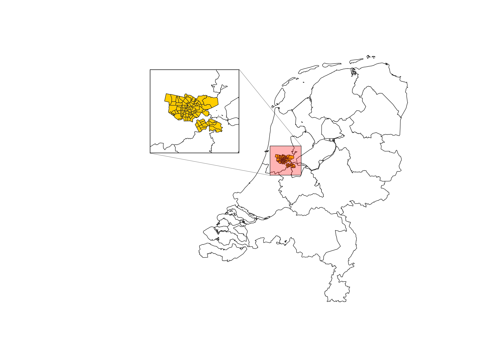
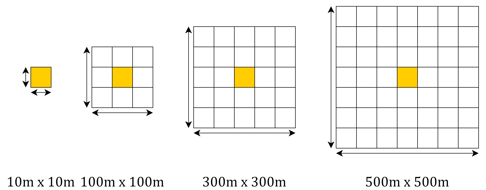

```{r setup, include=FALSE}
knitr::opts_chunk$set(tidy.opts=list(width.cutoff=60),tidy=TRUE)

```

A Spatial Statistics and Spatial Machine Learning approach.

Below the structure, results, and some code of our research can be found.

Kind regards,

Yúri Grings [Linkedin](https://www.linkedin.com/in/yurigrings/), Thomas Nibbering [Linkedin](https://www.linkedin.com/in/thomas-nibbering/), Jitse Ruurd Nauta [Linkedin](https://www.linkedin.com/in/jitseruurdnauta/) 

# Paper

## Introduction

Green spaces play an important role in urban ecosystems. As a natural purifier for cities, these areas help control soil erosion [1], improve air quality [2, 3], reduce the urban heat island effect [4–6] and are considered to be aesthetically pleasing [7]. Moreover, green areas in cities are shown to provide notable improvements in residents’ physical and mental wellbeing [8, 9]. As the benefits of greenness in urban areas are increasingly recognised, numerous cities have developed urban greening programs to expand parks, build green roofs or plant more trees [10–12]. However, evaluating the effects of these initiatives to justify their costs remains a challenge, partly due to data sparsity. 

A review of literature revealed that there are several studies that aimed to examine the effect of urban green spaces on residential house prices [13–19]. Often these studies adopted a hedonic pricing approach to estimate the economic value that individuals place on particular property characteristics, as reflected in the real-estate prices [14, 15]. However, most literature only focused on the distance to urban green areas as a valuation indicator [20, 21]. Here, a few studies considered a more comprehensive appreciation of greenness in cities by employing vegetation indices and the interaction with property and public amenities [16, 17, 22, 23]. 

Among the literature that explored the property value premium of urban green spaces more exhaustive, most adopted the normalised difference vegetation index (NDVI) [16, 22, 23]. Here, the relative abundance of vegetation was measured across varying buffer distances using remote sensing systems with various spatial resolutions. Moreover, most of these studies also considered the interaction with residential and public amenities, such as the number of rooms or proximity to convenience stores [16, 23]. However, these analyses were mainly performed in cities with conservative urban greening programs in place [23]. Lastly, the adoption of NDVI for identifying (urban) green spaces is often criticised due to its sensitivity to varying spatial scales and inability to differentiate between vegetation types [24]. Nonetheless, the index is widely accepted and can be considered almost a standard approach [25, 26]. 

Based on the examined literature, a hedonic pricing approach in combination with the normalised difference vegetation index and the interaction with particular amenities emerges as an effective method to estimate the effect of urban green spaces on residential house prices. Given the limited literature available on property value premiums associated with greenness exposure in cities with more progressive urban greening programs, this study aims to answer the research question of what the economic value of urban green spaces in the city of Amsterdam is in the year 2023, as reflected in the real-estate prices.

## Methods

### Study Area

The geographical scope in this study concentrated on the city of Amsterdam, as presented in Figure 1. The city is situated in the Western part of the Netherlands and home to almost 880,000 residents [27] that occupy a space of 219.3 km2  [28]. As a result, the city is considered one of the most densely populated in the country. Surrounding the residential areas, the vast majority of land is occupied with vegetation [29]. Moreover, the municipality has progressive urban greening programs in place, stimulating and obligating residents and city districts to participate in greening initiatives [12]. As a result, these policies aimed at expanding urban green spaces have the potential to increase nearby housing premiums. 




### Data

In this study, property listings were obtained from Funda.nl, a Dutch online real-estate platform [30]. Here, data included the sale price and property characteristics of residential houses in Amsterdam listed on the platform on 31 March 2023. Moreover, information about multiple public amenities in Amsterdam were obtained from a variety of sources, including ArcGIS [31], OpenStreetMap.org [32, 33] and the municipality of Amsterdam [34]. Selection of public amenities, used as controlling variables, were based on applicable literature, as presented in Table 1. Adjusting for these variables was done to limit the effect of potential confounders on the association of interest. Finally, remote sensing images in red and near-infrared were obtained from Sentinel-2 in August 2022 [35]. This allowed on the capitalisation of high greenness levels in that period, leading to improved differentiation between green and urban areas. 


### Data Enrichtment





## We used the Funda-Scraper package to scrape our data

The query below was used to scrape our final research data on (28-03-2023).

```{python eval = FALSE}
scraper = FundaScraper(area="provincie-noord-holland", want_to="buy", find_past=False,\
n_pages = 1000)
df = scraper.run()
```
Note that this is not the original Funda-Scraper code underneath. The Function is adjusted to contain additional adress information, compared to the origional function. Code is included in the Scraper.ipynb file to copy the updated package into the site-packages directory of python.

## A pre-processing pipeline is used to enrich data

OSM was used to enrich the scraped data. We geocode adressess into geometries objects for in order to make use of the geospatial models.
Additional spatial data includes:

* Distance to public transport (Bus, Subway, and Train)
* Distance to public services (Schools, Universities, Shopping centres)

## This enriched data is used to fit an OLS model

### OLS on scraped data

```{r eval = FALSE}
model <- lm(price~ room + bedroom + bathroom + living_area + house_age, data = funda_data)
```

### OLS on enriched data

```{r eval = FALSE}
model <- lm(price~ room + bedroom + bathroom + living_area + house_age + bus_dist +subway_dist + train_dist + university_dist + school_dist + mall_dist + supermarket_dist, data = funda_data)
```


### GWR model to adjust for spatial component in the data

To look at local spatial dependence, a GWR model was fit on the data.

```{python eval = FALSE}
#Run basic GWR in parallel mode

gwr_selector = Sel_BW(b_coords, b_y, b_X)
gwr_bw = gwr_selector.search(pool = pool)
print(gwr_bw)
gwr_results = GWR(b_coords, b_y, b_X, gwr_bw).fit(pool = pool)
    
```

### MGWR model to adjust for spatial component in the data

As it would be more realistic to have different band-widths for every feature, MGWR was used

```{python eval = FALSE}
#run MGWR in parallel mode. Note: max_iter_multi needs to be specified

mgwr_selector = Sel_BW(b_coords, b_y, b_X, multi=True)
mgwr_bw = mgwr_selector.search(pool=pool, max_iter_multi=200, criterion = "AICc") 
print(mgwr_bw)
mgwr_results = MGWR(b_coords, b_y, b_X, selector=mgwr_selector).fit(pool=pool)
    
```

