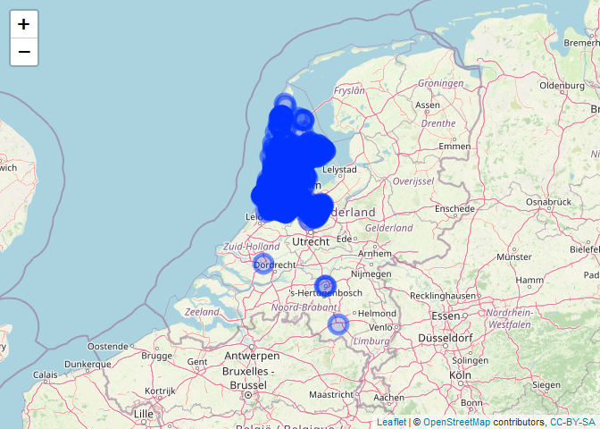

Explaining Noord-Holland house prices
================
Yúri Grings, Thomas Nibbering, Jitse Ruurd Nauta
2023-03-21

<style type="text/css">
  body{
  font-size: 12pt;
  font-family:Cambria;
  text-align: justify;
}
headers{
text-align: left;

}
</style>

# “Explaining Noord-Holland house prices”

A Spatial Statistics and Spatial Machine Learning approach.

Included data of the research was scraped from Funda. Below map gives an
overview of the scope of the data.

``` r
library(leaflet)
```

    ## Warning: package 'leaflet' was built under R version 4.0.5

``` r
df <- read.csv('data/test/funda_buy_21-03-2023(sample100p)latlon.csv')


leaflet(df) %>% addTiles() %>%
  addCircleMarkers(lng = ~longitude, lat = ~latitude, 
             popup = ~address)
```

    ## Warning in validateCoords(lng, lat, funcName): Data contains 122 rows with
    ## either missing or invalid lat/lon values and will be ignored

<!-- -->
