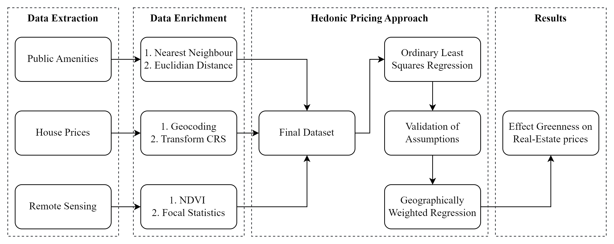

Estimating the Effect of Urban Green Spaces on Residential House Prices
================

This study served as our term project performed at the end of the course
Spatial Statistics and Machine Learning.

The goal of this research was to estimate the effect of greenness on
house prices in Amsterdam.

Below is a short overview of the structure of the GitHub page,
methodology, data sources, and code.

Full paper can be found in the directory
[here](https://github.com/JitseRuurd/Amsterdam_Urban_Green/blob/main/Paper/Term-Project---Grings%2C-Nauta%2C-Nibbering.pdf)!

Kind regards,

Yúri Grings [Linkedin](https://www.linkedin.com/in/yurigrings/), Thomas
Nibbering [Linkedin](https://www.linkedin.com/in/thomas-nibbering/),
Jitse Ruurd Nauta
[Linkedin](https://www.linkedin.com/in/jitseruurdnauta/)

# Stucture of the directory

The way the data analysis was performed is described in the figure
below. The text after the figure provides some insight into the steps
that were taken during each phase.



## Data Extraction

The used data regarding the Public Amenities can be found in the
[/data/Amsterdam/
folder](https://github.com/JitseRuurd/Amsterdam_Urban_Green/tree/main/data/Amsterdam)
and partly in the [1.c Data Enrichment
script](https://github.com/JitseRuurd/Amsterdam_Urban_Green/blob/main/1c.%20Data%20enrichment.R).
The data sources consisted of the Municipality of Amsterdam, ArGIS and
OSM.

The House price data was extracted with the help of the Funda-Scraper
package. This code was however modified to be able to extract a more
precise address line, which could be used for geocoding the address to
spatial data.

The [Funda scraper
notebook](https://github.com/JitseRuurd/Amsterdam_Urban_Green/blob/main/Scraper/Scraper.ipynb)
provides code to copy the code of the enhanced Funda scraper in the
site-packages or dist-packages directory of python:

``` python
#import function to copy the scraper folder into the dist-packages or site-packages libraries
from copy_scraper import copy_scraper
copy_scraper()
```

To extract the data for this project, below query was used:

``` python
####
# 2. Data
####
# Obtain Data
scraper = FundaScraper(area="amsterdam", want_to="buy", find_past=False, n_pages = 1000)
df = scraper.run()
```

Lastly, the Remote Sensing data was extracted with below code in the
[1b.Pre-Processing
script](https://github.com/JitseRuurd/Amsterdam_Urban_Green/blob/main/1b.%20Pre-Processing.ipynb),
and was inspired from the Planetary computer:

``` python
####
# 1. Obtain Data
####
# Define Catalog
catalog = pystac_client.Client.open("https://planetarycomputer.microsoft.com/api/stac/v1",modifier=planetary_computer.sign_inplace)

# Obtain Area of Interest
bbox_of_interest = [4.541943,52.193249,5.212109,52.532048] 
time_of_interest = "2022-06-01/2022-09-30" 

# Search Data
search = catalog.search(collections=["sentinel-2-l2a"],
                        bbox=bbox_of_interest,
                        datetime=time_of_interest,
                        query={"eo:cloud_cover": {"lt": 20}})

# Obtain Data
items = search.item_collection()

# Select Item from List
selected_item = items[4]

# Obtain Bands of Interest
data = odc.stac.stac_load([selected_item], bands = ['red', 'green', 'blue', 'nir'], bbox = bbox_of_interest).isel(time=0)
```

## Data Enhancement

The data enhancement for the public amenities was performed in the [1.c
Data enrichment
script](https://github.com/JitseRuurd/Amsterdam_Urban_Green/blob/main/1c.%20Data%20enrichment.R).
The steps within this script consist of finding the nearest facility for
every house regarding every public amenity included.

To use the Funda.nl data for the analysis, the [pre-processing R
script](https://github.com/JitseRuurd/Amsterdam_Urban_Green/blob/main/1a.%20Pre-processing.R)
provides the code to geocode the adresses from the Funda.nl data to
latlon column. Below chunk shows this code:

``` r
df_geo <- df %>%
    separate(address_line, c("zip", "letters", "city", "optional1",
        "optional2", "optional3", "optional4", "optional5"),
        " ") %>%
    mutate(addressline_city = paste(city, optional1, optional2,
        optional3, optional4, optional5), addressline_zip = paste(zip,
        letters), addresszip = paste0(address, ", ", addressline_zip,
        ", ", addressline_city)) %>%
    select(-optional1, -optional2, -optional3, -optional4, -optional5) %>%
    geocode(addresszip, method = "osm", lat = latitude, long = longitude)
```

The pre-processing of the Remote sensing data consists of the
computation of the NDVI value. This was done in the [1b.Pre-Processing
script](https://github.com/JitseRuurd/Amsterdam_Urban_Green/blob/main/1b.%20Pre-Processing.ipynb)
with below code:

``` python
ndvi = xrspatial.multispectral.ndvi(data['nir'], data['red'])

ndvi.values[ndvi.values < 0] = 0
```

Note that negative NDVI values where set to 0.

## Hedonic pricing approach

With the enhanced data, several models where used to estimate the effect
of greenness on the house prices in Amsterdam.

First, an OLS model was used:

``` r
equation <- price_m2 ~ bedroom + bathroom + living_area + house_age +
    tram_dist + metro_dist + train_dist + ndvi300 + centre_dist +
    zuid_dist + shops_dist + school_dist

# OLS
model <- lm(equation, data = funda_data)
```

After checking the Linear regression assumptions (results stated in the
paper), an Geographically Weighted Regression (GWR) model was used as
implemented below:

``` python
#Run basic GWR in parallel mode
gwr_selector = Sel_BW(b_coords, b_y, b_X, kernel='bisquare')
gwr_bw = gwr_selector.search(pool = pool, criterion = "AIC") 
print(gwr_bw)
gwr_results = GWR(b_coords, b_y, b_X, gwr_bw, kernel="bisquare").fit(pool = pool)
```

## Results

With the final GWR model, the results of the analysis were created. The
main output of the analysis was the significant coefficient map shown
below.


The interpetation and conclusion of this plot is stated in chapter 3 and
4 of the report, respectively.
